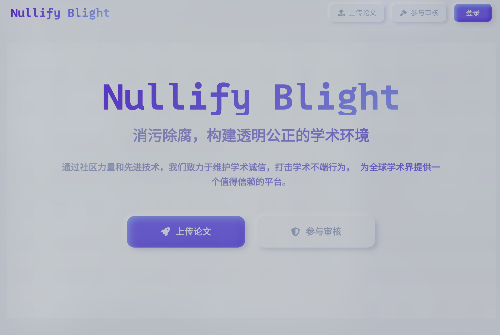

# 消污除腐 (Nullify Blight) 🚧

> **⚠️ 注意：本项目正在积极开发中，功能可能会随时变更。**

一个专注于学术诚信的开源平台，致力于消除学术腐败行为，促进学术研究的健康发展。

## 📖 项目简介

消污除腐是一个基于现代化技术栈构建的学术监督平台，旨在：

- 📄 提供论文上传和管理系统
- 🔍 支持论文审核和评价机制
- 💬 建立学术讨论和评论社区
- 🛡️ 确保用户认证和数据安全
- 📊 提供数据统计和分析功能

## 🌐 在线预览

> **⚠️ 当前状态说明：**
>
> - 🔗 **预览地址**: [https://nullify-blight.vercel.app/](https://nullify-blight.vercel.app/)
> - 🌍 **访问限制**: 需要翻墙才能访问
> - 🔧 **功能状态**: 仅前端界面可浏览，后端API未部署，所有功能暂不可用
> - 🚀 **最终部署**: 开发完成后将部署到正式服务器



## ✨ 主要功能

### 🔐 用户系统
- GitHub OAuth 集成登录
- 邮箱验证机制
- 用户角色管理
- 个人资料管理

### 📄 论文管理
- 论文上传和存储
- 论文元数据管理
- 论文状态跟踪
- 批量处理支持

### 🔍 审核系统
- 多级审核流程
- 审核意见记录
- 审核历史追踪
- 自动化审核辅助

### 💬 社区功能
- 论文评论系统
- 用户互动功能
- 通知系统
- 实时更新

### 📊 数据统计
- 审核数据统计
- 用户活跃度分析
- 平台使用报告
- 可视化图表展示

## 🏗️ 技术架构

### 前端 (Next.js)
- **框架**: Next.js 15+
- **语言**: TypeScript
- **样式**: Tailwind CSS
- **UI组件**: 自定义组件库
- **状态管理**: React Context
- **部署**: Vercel

### 后端 (NestJS)
- **框架**: NestJS
- **语言**: TypeScript
- **数据库**: PostgreSQL (Neon)
- **ORM**: Prisma
- **认证**: JWT + GitHub OAuth
- **邮件**: Nodemailer
- **部署**: Railway

### 数据库设计
- **用户表**: 用户信息、认证数据
- **论文表**: 论文元数据、文件信息
- **审核表**: 审核记录、意见反馈
- **评论表**: 用户评论、互动数据

## 🚀 快速开始

### 环境要求
- Node.js 18+
- npm 或 pnpm
- Git

### 本地开发

1. **克隆项目**
   ```bash
   git clone <repository-url>
   cd WuHanUniversity
   ```

2. **安装依赖**
   ```bash
   # 前端依赖
   cd frontend
   npm install

   # 后端依赖
   cd ../backend
   npm install
   ```

3. **环境配置**
   ```bash
   # 前端环境变量
   cp frontend/.env.example frontend/.env.local

   # 后端环境变量
   cp backend/.env.example backend/.env
   ```

4. **数据库设置**
   ```bash
   cd backend
   npx prisma migrate dev
   npx prisma db seed
   ```

5. **启动开发服务器**
   ```bash
   # 前端 (新终端)
   cd frontend
   npm run dev

   # 后端 (新终端)
   cd backend
   npm run start:dev
   ```

6. **访问应用**
   - 前端: http://localhost:3000
   - 后端: http://localhost:3001

> **💡 提示**: 当前在线预览版本 (https://nullify-blight.vercel.app/) 仅部署了前端，后端API服务未部署。如需测试完整功能，请按照本地开发步骤运行项目。

## 📦 部署指南

详细的部署说明请参考 [DEPLOYMENT.md](DEPLOYMENT.md)

### 快速部署
```bash
# Linux/Mac
./deploy.sh

# Windows
deploy.bat
```

### 生产环境部署
1. **数据库**: Neon PostgreSQL
2. **后端**: Railway
3. **前端**: Vercel

## 📚 API 文档

后端 API 文档在启动服务后可通过以下方式访问：
- Swagger UI: http://localhost:3001/api

## 🤝 贡献指南

欢迎提交 Issue 和 Pull Request！

1. Fork 本仓库
2. 创建功能分支 (`git checkout -b feature/AmazingFeature`)
3. 提交更改 (`git commit -m 'Add some AmazingFeature'`)
4. 推送到分支 (`git push origin feature/AmazingFeature`)
5. 创建 Pull Request

### 开发规范
- 遵循现有的代码风格
- 添加必要的测试
- 更新相关文档
- 确保 CI/CD 通过

## 📄 许可证

本项目采用 AGPL 许可证 - 查看 [LICENSE](LICENSE) 文件了解详情。

## 📞 联系我们

- 问题反馈: [Issues]
- 功能请求: [Discussions]

---

**⭐ 如果这个项目对你有帮助，请给它一个星标！**

**🚧 开发状态**: 本项目正在积极开发中，欢迎社区贡献和建议。
